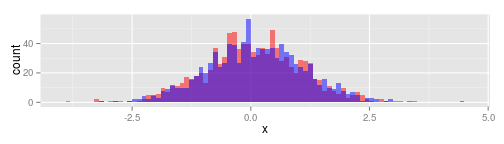

## Motivation

The goal of this Shiny server is to illustrate a few possibilities:

1. Input parameters

2. Reactive functions

3. Plot output

--- .class #id 

## Chosen example

The application draws samples from 2 normal distributions, whose parameters are chosen by the user. It plots them for comparison.

### Inputs

The user chooses the parameters for the 2 normal disitributions and the number of points to draw.

### Outputs

The server outputs the histograms showing the overlap between the two distributions.

It also perfoms a 2 sample T-test and gives the 95% confidence interval for the difference between the means, and the p-value for a null difference.

--- .class #id 

## Results

It can be used to show that even with a lot of overlap, we can distinguish small differences if the number of points is large enough. E.g. $\mu_1 =0$ and $\mu_2=0.1$ for $\sigma=1$ and $n=1000$:

 


```r
result<-t.test(draw1$x, draw2$x)
result$conf.int[1:2]
```

```
## [1] -0.13923527  0.03983772
```

```r
result$p.value
```

```
## [1] 0.2764743
```

